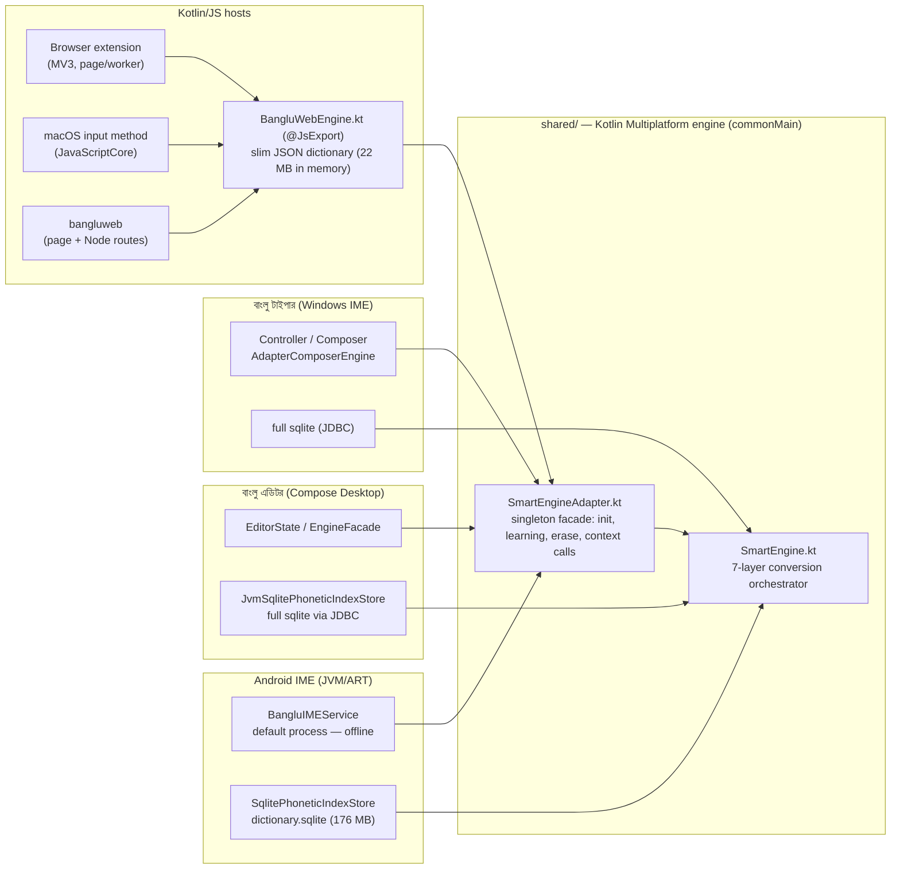
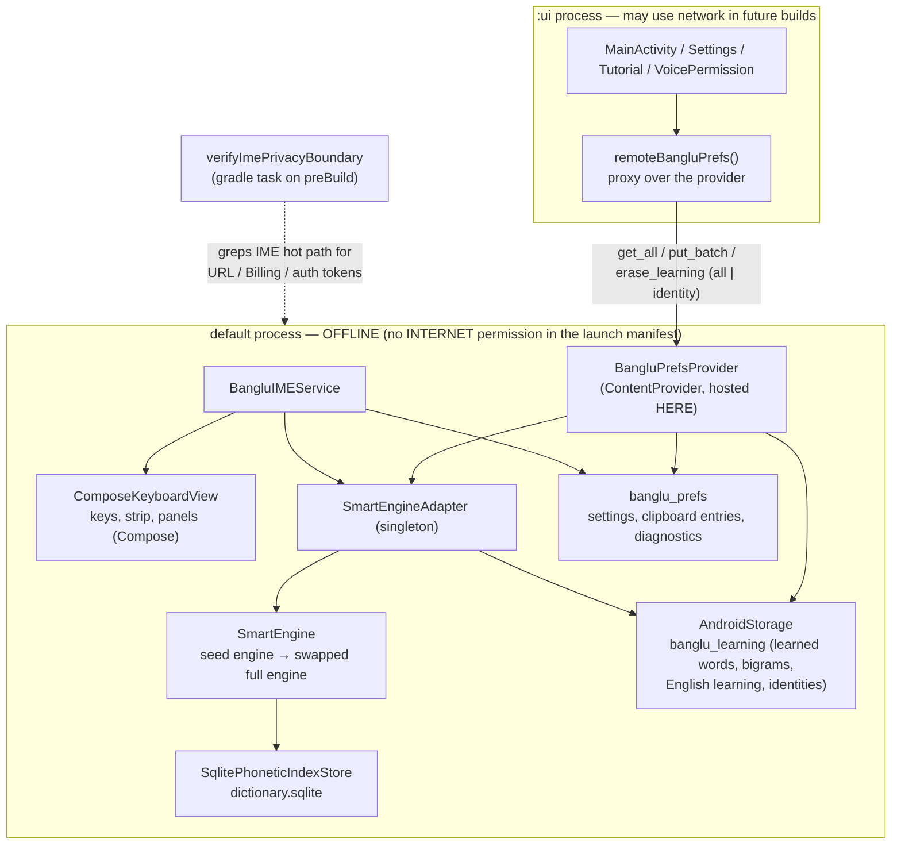
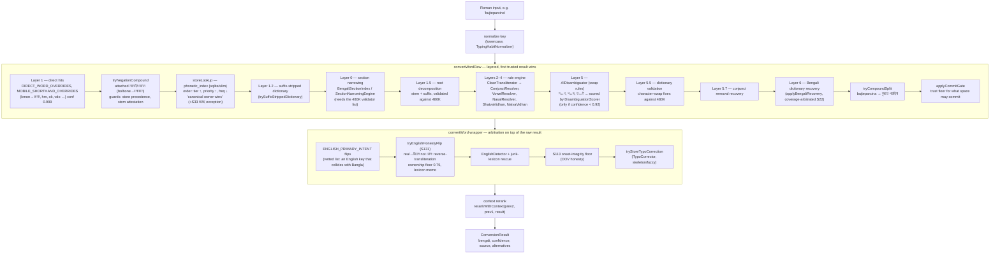
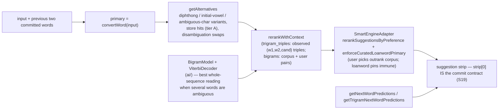
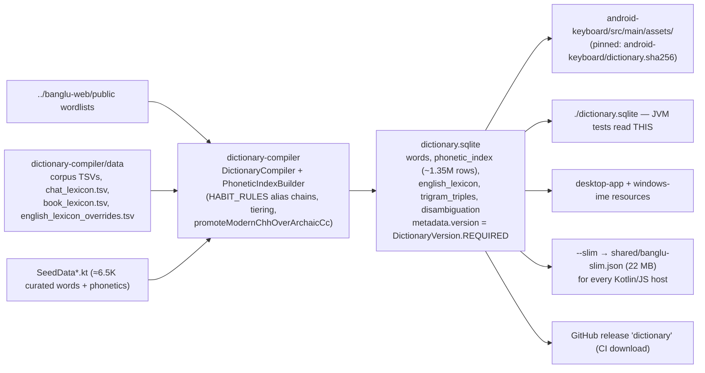
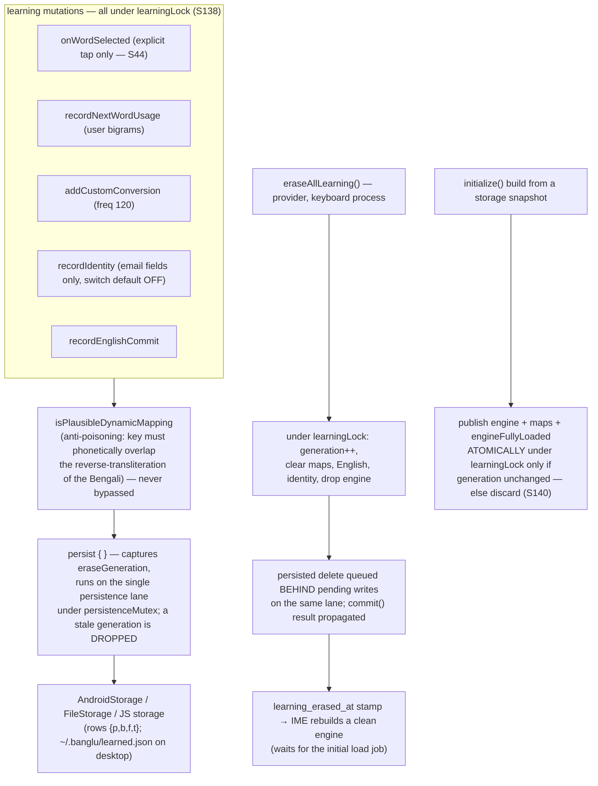

# Banglu Engine — Architecture Reference

**Status:** reference document, written 2026-08-26 against `main` at v1.5.87 (Android 2124).
**Scope:** the shared conversion engine (`shared/`), how each surface hosts it, the
Android keystroke path, the learning system, the voice pipeline and the dictionary
build. Every box below names the real file or function so the diagram can be checked
against the code.

**One-sentence description you can use anywhere:** Banglu is an on-device Bangla
phonetic engine — Avro-compatible phonetic rules, a curated dictionary of ~485,000
words, and a statistical (n-gram) context model that learns your spelling preferences
on the phone; nothing you type leaves the device. It is a rule-based and statistical
system, not a neural network and not "AI".

---

## 1. System context — one engine, six surfaces

The law that keeps six products manageable: **conversion behaviour lives in `shared/`
(Kotlin Multiplatform) and nowhere else.** Platforms differ only in how they host the
engine and which dictionary tier they carry.



**Contract for every host (S130 law):** hosting the engine is not parity — the
context calls are part of the contract: `convertWordWithContext`,
`getSuggestionsWithContext`, `recordNextWordUsage`, `getNextWordPredictions`.

**Parity walls:** JVM `:shared:jvmTest` (real `./dictionary.sqlite`), JS
`:shared:jsNodeTest`, macOS `swift run BangluCoreTestRunner`, desktop
`:desktop-app:test`, Android unit + `connectedDebugAndroidTest`.

---

## 2. Android process and privacy architecture (non-negotiable)



Why the provider matters: Android processes share no singleton memory. Anything
that must *persist* — a settings write, an erase — is only real when it runs in the
keyboard process, which owns the one true `SharedPreferences` instance and the live
engine. `SettingsActivity` therefore never touches the engine directly; it calls the
provider (`eraseLearningInKeyboardProcess`) and shows success only on a confirmed
result (S135/S136).

---

## 3. The conversion pipeline — `SmartEngine.convertWord`

The engine converts **one word at a time**. `convertWord` is a wrapper that applies
typo correction and English arbitration around `convertWordRaw`, which runs the
layered pipeline and stops at the first layer that produces a trusted result.



Notes that matter when reading the code:

- **Ranking law** in the phonetic index: rows order by `(tier ASC, priority ASC,
  freq DESC)`. `tier 0` = suggestible corpus words; `priority 0` = canonical
  romanization owner, `1` = habit alias. HABIT_RULES compose in table order in the
  compiler (`PhoneticIndexBuilder`) — a later rule never re-triggers an earlier one.
- **Lite mode** (`liteModeEnabled || isLowRamDevice || memoryClass < 256`): the
  loader skips the 480K validator, frequency scores, disambiguation map and bigram
  model. Layers 0/1.5/5.5/5.7/6 need the validator and simply do not run; the store
  and seeds still serve conversions. Any wrapper feature must either work without the
  validator or stay out of the composing preview (S26b law).
- **Invariants pinned by tests** (never "fix" them by editing a pin):
  kacci→কাচ্চি, jos→জোস, kassi→কাচছি, name→নামে, real→রিয়েল, roll→রোল.

---

## 4. Suggestions, alternatives and the context model



**What the "statistical model" is, precisely.** An **n-gram model** is a table of
how often words appear next to each other in real Bangla text: after আমি, "ভালো" has
followed far more often than "ভাল্লুক", so it ranks first. Banglu stores bigram pairs
and trigram triples compiled from the corpus (`trigram_triples` in the sqlite) plus
the user's own pairs. **Viterbi** is the shortcut for choosing the best *whole
sentence* at once: it walks the candidates word by word, keeps only the most likely
path so far at each step, and ends with the single most probable sequence without
trying every combination. Promotion of an alternative over the primary stays
evidence-gated (S4/S20): it needs an *observed* triple, never interpolated
probability alone.

---

## 5. The Android keystroke hot path (S28/S29/S32 — keep it this way)

```mermaid
sequenceDiagram
    participant U as User
    participant IME as BangluIMEService (main thread)
    participant ENG as Engine (Dispatchers.Default / engineLane)
    participant IC as InputConnection (host app)

    U->>IME: key press (commit on pointer DOWN)
    IME->>IME: buffer += char
    IME->>IME: convertForInstantPreview(buffer)<br/>rule-only, zero I/O, sub-ms
    IME->>IC: setComposingText(instant preview)
    IME-)ENG: async refine (job-cancel coalescing,<br/>buffer == snapshot guard)
    ENG-->>IME: refined ConversionResult + suggestions
    IME->>IC: setComposingText(refined) + strip update
    U->>IME: space
    alt cached async result ready
        IME->>IC: commitText(cached primary)
    else not ready
        IME->>IC: commit the VISIBLE preview instantly
        IME-)ENG: reconcile off-thread (replace only while the editor<br/>still ends with what we committed; session token + buffer guards)
    end
    IME->>ENG: recordNextWordUsage(prev, committed) [learning gates apply]
```

Rules enforced by tests and StrictMode (debug builds flag any main-thread disk I/O):
no synchronous dictionary/SQLite/disk work on the main thread; WYSIWYG — the
composing preview and the space commit must agree (full and lite); cold start builds
the seed engine off-main and the instant preview returns raw input until seeds land
(~180 ms to first view).

---

## 6. Dictionary build and delivery



The version gate (S108): `DictionaryVersion.REQUIRED` is the single bump point; the
compiler stamps it, every store refuses a mismatch, and the release validator refuses
an asset whose SHA-256/size/version differ from the pin.

---

## 7. Learning and erasure (poisoning-hardened, cross-process, race-free)



Other laws: no learning at all until the full dictionary load completes (S34);
passive space-commits of the engine's own primary are never recorded (S26); a
learned entry equal to the raw transliteration of its key is skipped on load when it
is not a corpus word and the pipeline resolves elsewhere (S34 heal — skipped ≠
deleted).

---

## 8. Voice typing (S137 model of Google's speech service)

The keyboard never touches audio: `SpeechRecognizer` hands the microphone to the
phone's speech service (Google's on Play-certified phones). What Banglu owns is
session management and how partial hypotheses become committed text — and the
field traces showed the recognizer behaves like this:

```mermaid
stateDiagram-v2
    [*] --> Listening: mic tap → fresh SpeechRecognizer (never reused, S92)
    Listening --> Rendering: partial hypotheses (cumulative within an utterance)
    Rendering --> Rendering: VoicePartialDiff — revise only the diverging tail,<br/>fuzzy word match (VoiceWordMatch), never delete earlier words
    Rendering --> Sealed: recognizer RESET detected<br/>(VoiceCarryPolicy.reconcile: no shared prefix / new beginning)<br/>→ seal live region with a MARK ONLY, never re-commit text
    Rendering --> IdleStop: 1.5 s after speech with no new speech<br/>→ stopListening() (before Google's own endpoint degrades later utterances)
    IdleStop --> Deferred: empty final is normal → screen text is the final;<br/>punctuation deferred (দাঁড়ি at 2.8 s, comma if speech resumes ≥ 1.4 s)
    Deferred --> Listening: restart after 250 ms settle (no-delay restarts → ERROR_SERVER_DISCONNECTED)
    Listening --> Listening: silence → NO_MATCH ladder, up to 6 sessions (~30 s)
    Listening --> [*]: user stop / cancel (no দাঁড়ি on user stop — S42)
```



Pure, unit-pinned policies: `VoiceCarryPolicy`, `VoicePartialDiff`, `VoiceWordMatch`,
`VoiceSessionPolicy`, `VoiceAnchorPolicy`, `VoiceTextNormalizer`.

---

## 9. Where the pieces live

| Concern | File(s) |
|---|---|
| Conversion orchestrator | `shared/src/commonMain/kotlin/com/banglu/engine/SmartEngine.kt` |
| Host facade, learning, erase, context calls | `…/engine/SmartEngineAdapter.kt` |
| Rules | `…/engine/rules/` (CleanTransliterator, ConjunctResolver, VowelResolver, NasalResolver, ShatvaVidhan, NatvaVidhan, StatisticalDefaults) |
| Dictionary structures | `…/engine/dictionary/` (SmartDictionary, PhoneticTrie, BengaliWordValidator, SectionNarrowingEngine, FrequencyRanker, SeedData*) |
| Statistical model | `…/engine/ai/` (BigramModel, ViterbiDecoder, AIDisambiguator, EnglishDetector) |
| Disambiguation scoring | `…/engine/disambiguation/DisambiguationScorer.kt` |
| English typing suite | `…/engine/english/` |
| Touch targeting | `…/engine/touch/` (TouchTargetModel, CharBigramData) |
| Identity assist | `…/engine/assist/IdentityAssist.kt` |
| Platform seams | `…/engine/platform/` (PhoneticIndexStore, PlatformStorage, DictionaryLoader) |
| Android IME | `android-keyboard/src/main/kotlin/com/banglu/keyboard/BangluIMEService.kt`, `ComposeKeyboardView.kt`, `SqlitePhoneticIndexStore.kt`, `AndroidStorage.kt`, `BangluPrefsProvider.kt` |
| Voice policies | `android-keyboard/.../Voice*.kt` |
| Compiler | `dictionary-compiler/` (DictionaryCompiler, PhoneticIndexBuilder) |
| Release gate | `scripts/validate_android_release.sh`, `scripts/android_device_smoke.py`, `scripts/verify_dictionary_pin.sh` |

## 10. Glossary

- **Phonetic (Avro-style) typing** — writing Bangla with lowercase English letters
  by sound; the engine maps them to Bangla script.
- **Tier / priority** — the index's ranking keys: tier 0 words are suggestible corpus
  words; priority 0 is the canonical romanization owner, 1 a habit alias.
- **n-gram model** — counts of word pairs/triples from real text, used to rank the
  likely next word and to pick between homophones by context.
- **Viterbi decoding** — the efficient search for the most probable whole sequence of
  words given those counts.
- **WYSIWYG contract** — what the composing preview shows is exactly what space
  commits.
- **Lite mode** — the reduced-memory configuration for low-RAM phones; conversions
  stay store-backed.
- **Learning generation / learningLock** — the mechanism that makes "Clear learned
  data" complete and race-free across threads and processes.
