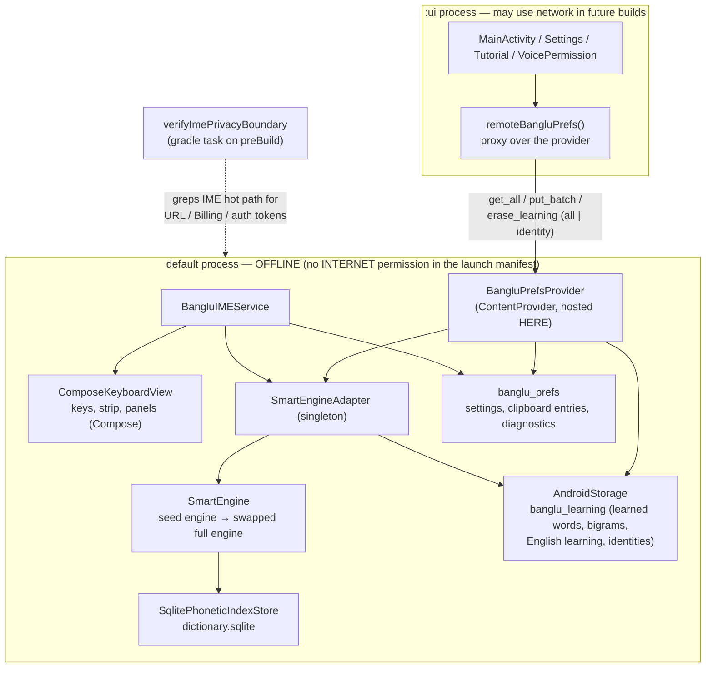
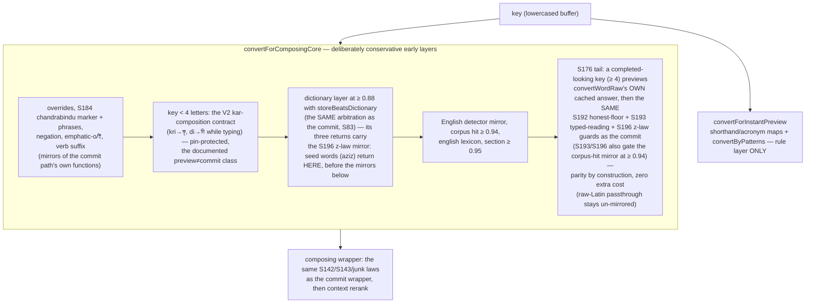
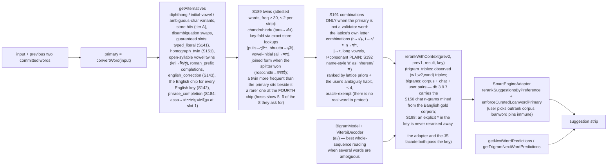
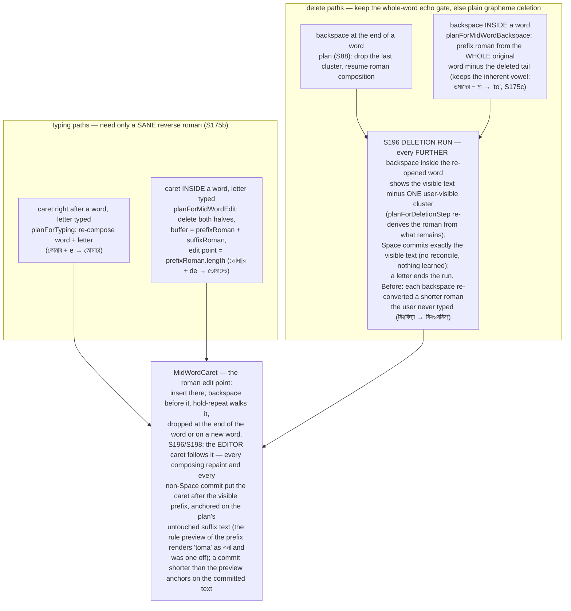
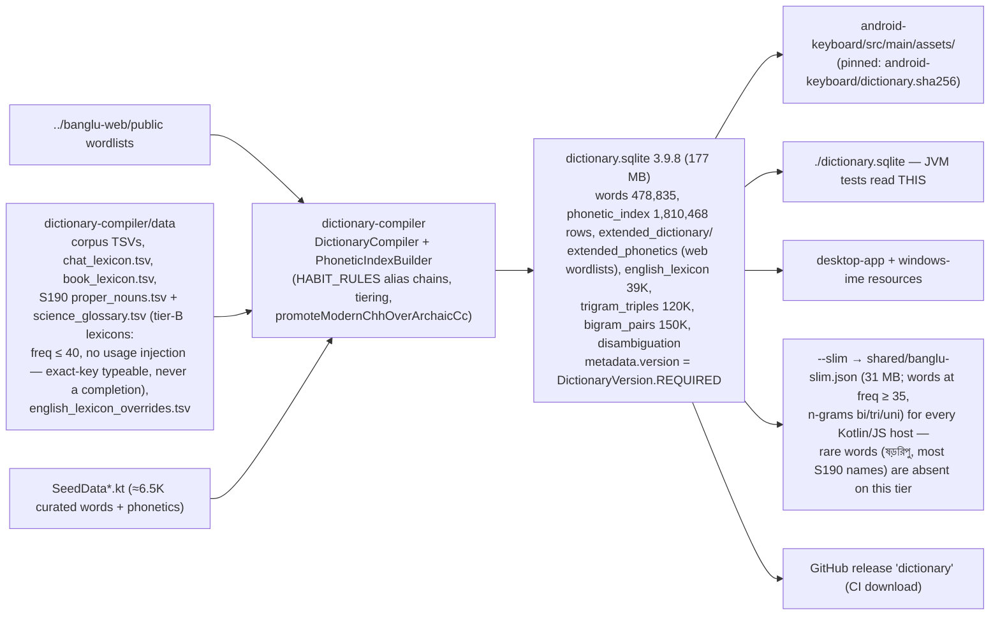
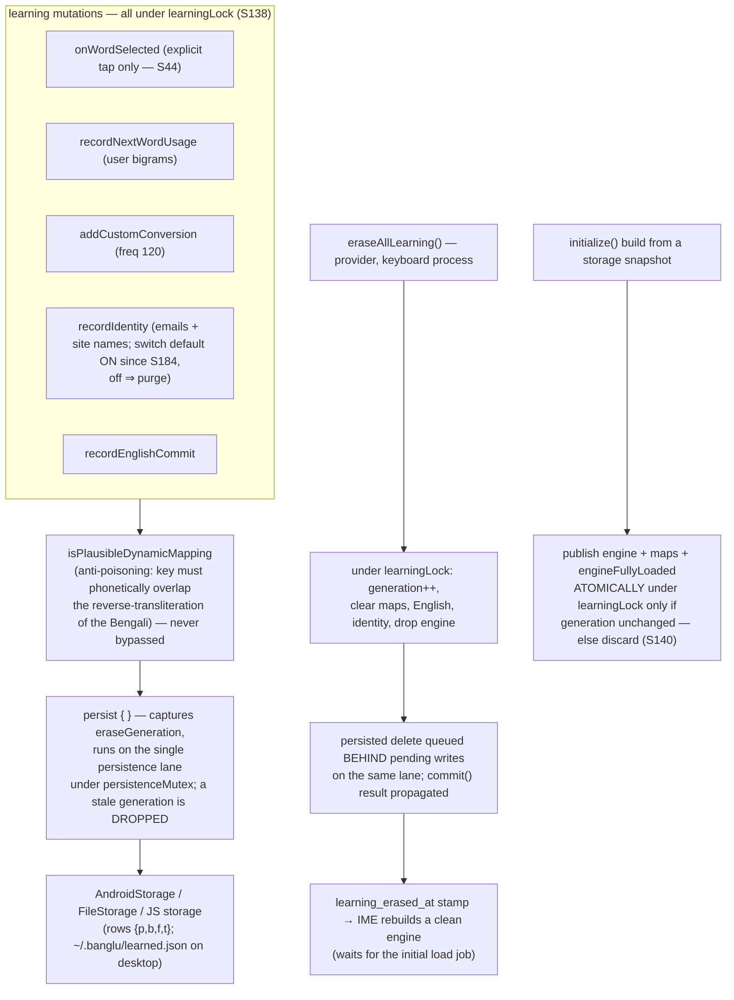

# Banglu Engine — Architecture Reference

**Status:** reference document, written 2026-08-26 against v1.5.87, revised
2026-09-03 against v1.5.113 and again 2026-09-06 against `main` at v1.5.131 (Android
2168, dictionary 3.9.8). Rounds S138–S198 are folded in; the S-numbers in the text point
at the commit messages that carry the evidence.
**Scope:** the shared conversion engine (`shared/`), how each surface hosts it, the
Android keystroke path, the learning system, the voice pipeline and the dictionary
build. Every box below names the real file or function so the diagram can be checked
against the code.

**One-sentence description you can use anywhere:** Banglu is an on-device Bangla
phonetic engine — Avro-compatible phonetic rules, a compiled dictionary of ~479,000
words (1.8 M romanization rows), and a statistical (n-gram) context model that learns your spelling preferences
on the phone; nothing you type leaves the device. It is a rule-based and statistical
system, not a neural network and not "AI".

---

## 1. System context — one engine, six surfaces

The law that keeps six products manageable: **conversion behaviour lives in `shared/`
(Kotlin Multiplatform) and nowhere else.** Platforms differ only in how they host the
engine and which dictionary tier they carry.


**Contract for every host (S130 law):** hosting the engine is not parity — the
context calls are part of the contract: `convertWordWithContext`,
`getSuggestionsWithContext`, `recordNextWordUsage`, `getNextWordPredictions`.

**Parity walls (invariant 13 — every engine or surface change runs ALL of them):**
JVM `:shared:jvmTest` (real `./dictionary.sqlite`), `:shared:testDebugUnitTest`,
`:android-keyboard:testDebugUnitTest`, JS `:shared:jsNodeTest`, desktop
`:desktop-app:test`, `:windows-ime:test`, and macOS `swift run BangluCoreTestRunner`
whenever its JS bundle is rebuilt. A change that flips an existing pin is a documented
decision recorded in the pin, never a silent edit. After a dictionary rebuild the walls
must run with `--rerun` (gradle does not see the sqlite/slim as test inputs).

**Propagation:** a shared-engine round ships on Android first, then the same artifact
reaches the other five surfaces (macOS bundle + runner + install, extension zips,
bangluweb vendor push, desktop/Windows version tags built by CI, and the GitHub
`downloads` release alias the website links).

---

## 2. Android process and privacy architecture (non-negotiable)



Why the provider matters: Android processes share no singleton memory. Anything
that must *persist* — a settings write, an erase — is only real when it runs in the
keyboard process, which owns the one true `SharedPreferences` instance and the live
engine. `SettingsActivity` therefore never touches the engine directly; it calls the
provider (`eraseLearningInKeyboardProcess`) and shows success only on a confirmed
result (S135/S136).

---

## 3. The conversion pipeline — `SmartEngine.convertWord`

The engine converts **one word at a time**. `convertWord` is a wrapper that applies the
English-word laws, the typed-faithful law and typo correction around `convertWordRaw`,
which runs the layered pipeline and stops at the first layer that produces a trusted
result. The order below is the code's order (SmartEngine.kt, `convertWordRaw`).

```mermaid
flowchart TD
    IN["Roman input, e.g. 'bujteparcina'"] --> NORM["normalize key<br/>(lowercase, TypingHabitNormalizer)"]
    NORM --> RAW

    subgraph RAW["convertWordRaw — layered, first trusted result wins (per-key LRU cache)"]
        L1["direct hits<br/>ACRONYM_OVERRIDES, DIRECT_WORD_OVERRIDES,<br/>MOBILE_SHORTHAND_OVERRIDES (kmon→কেমন, hm, ok, hath …) conf 0.999"]
        CH["S184: a key containing '^' (the chandrabindu marker —<br/>Android long-press c, the Avro habit elsewhere) is rendered<br/>by the RULE transliterator exactly as the instant preview<br/>(cha^d→চাঁদ); the marker-less dictionary reading is an alternative"]
        PH["S184: CulturalPhrases.EXACT — 24 greetings/religious phrases ×<br/>70 romans commit WITH their spacing (assalamualaikum→আসসালামু আলাইকুম)"]
        NEG["tryNegationCompound<br/>attached না/নাই/তো/নে (bolbone→বলবোনে)"]
        EMO["tryEmphaticOCompound / tryEmphaticICompound<br/>ashiko→আশিকও, ekdomi→একদমই (S56/S150)"]
        PVS["tryProductiveVerbSuffixConversion<br/>root + verb suffix table"]
        DICT["dictionary layer — convertByDictionary<br/>(seed + extended dictionary trie)<br/>then storeBeatsDictionary: the ONE dictionary-vs-store<br/>arbitration shared with the preview (S83)<br/>+ S177 completion-over-typed-word branch"]
        EN["EnglishDetector branch<br/>curated variant → english_lexicon → raw passthrough"]
        ST["tryCorpusPhoneticLookup — phonetic_index (sqlite/slim)<br/>order: tier ↑, priority ↑, freq ↓; 'canonical owner wins'<br/>(+S33 চ্চ/চ্ছ exception; S7 continuation guard,<br/>spared for a literal reading since S177)"]
        LEX["tryEnglishLexicon (lexicon words the detector misses)"]
        PS["tryProductiveSuffixConversion (টা/টি clitics)"]
        L12["Layer 1.2 — trySuffixStrippedDictionary<br/>two-pass since S173: trie stems, then store-only<br/>canonical stems (ষড়রিপু+র); renderInflection (ের after<br/>a consonant); vowel-junction law"]
        L0["Layer 0 — section narrowing<br/>(needs the 480K validator)"]
        L15["Layer 1.5 — convertByRootDecomposition<br/>(fragment-sanity guard)"]
        L24["Layers 2–4 — rule engine<br/>CleanTransliterator → ConjunctResolver, VowelResolver,<br/>NasalResolver, ShatvaVidhan, NatvaVidhan"]
        L5["Layer 5 — AIDisambiguator swap rules<br/>ন↔ণ, শ↔ষ, ত↔ট, ই↔য় … (only if confidence < 0.92)"]
        L55["Layer 5.5 / 5.7 — dictionary validation,<br/>conjunct-removal recovery"]
        L6["Layer 6 — applyBengaliRecovery<br/>a SPELLING normaliser only (S141 skeleton law),<br/>coverage-arbitrated against a compound split (S22)"]
        CS["tryCompoundSplit<br/>bujteparcina → বুঝতে পারছিনা"]
        TF["typo correction + fuzzy fallback<br/>(only when pattern confidence < 0.5)"]
        GATE["applyCandidateLatticeRanking → applyCommitGate<br/>(every composed form also passes applyCompositionCommitGate)"]
        L1 --> CH --> PH --> NEG --> EMO --> PVS --> DICT --> EN --> ST --> LEX --> PS --> L12 --> L0 --> L15 --> L24 --> L5 --> L55 --> L6 --> CS --> TF --> GATE
    end

    RAW --> WRAP

    subgraph WRAP["convertWord wrapper — the laws on top of the raw result"]
        FLOOR["S192 honestFloorForFarOffFuzzy (shared with the preview):<br/>key ≥ 7, fuzzy DICTIONARY result < 0.9, no space, whose reading is<br/>≥ 2 away under a transposition-aware (OSA) distance over the typist<br/>folds AND differs from the literal floor in spelling skeleton →<br/>the clean Bengali-only literal floor commits (chorpara→চরপারা, not চর্চার);<br/>the far-off word rides as an alternative"]
        TYPED["S193 typedReadingOverAddedLetters (shared with the preview):<br/>the store's TOP row is a habit alias whose reading is ONE leading vowel<br/>plus the typed key (oboddhota = o + boddhota — the verb rules obo→bo /<br/>oph→ph leak onto অ-initial nouns, 1,333 such keys) AND the typed reading is<br/>evidenced (validator word, or attested stem + তা/ত্ব) → the typed reading<br/>commits (boddhota→বদ্ধতা, phiser→ফিসের); the alias rides as a chip.<br/>Internal conjunct folds (shikha→শিক্ষা) are NOT letter additions — a wider<br/>gate flipped 386 chat keys and was rejected. A later typo correction<br/>that re-adds the letter is blocked for this floor only."]
        ZF["S196 zFaithfulReading (shared with the preview): the key carries a z and the<br/>answer differs from the INSTANT-PREVIEW reading (the rule layer is where 'z is য'<br/>lives) only in য↔জ, or lost the z → the instant reading commits, the dictionary word<br/>rides as a chip (aziz→আযিয + আজিজ, ajiz→আজিয, zakir→যাকির) — unless the word is everyday<br/>(validator freq ≥ 80: names 72–79 flip, chat words জেনে 81 / নিজে 84 / কাজ 92 stay),<br/>the key looks English, or the validator is absent (lite: both halves stand down).<br/>A replaced rule floor keeps floor confidence 0.62 so the S143 rescue still claims<br/>glued English keys; j for য stays the chat habit (jodi→যদি)"]
        EPI["ENGLISH_PRIMARY_INTENT flips<br/>(vetted keys: line→লাইন) — preference-immune"]
        HON["tryEnglishHonestyFlip (S131)<br/>real→রিয়েল not রোল"]
        PRON["applyEnglishPronunciationLaw (S142)<br/>a correct English word renders its pronunciation<br/>when the Bengali reading sits below the everyday band (75)"]
        RESC["applyEnglishSpellingRescue (S143)<br/>one-slip English spellings → the engine's own rendering<br/>of the correct word (suggention → সাজেশন)"]
        ONSET["S113 onset-integrity floor (OOV honesty)"]
        JUNK["tryJunkLexiconRescue"]
        TYPO["tryStoreTypoCorrection — with the S141 typed-faithful law:<br/>a clean-reading literal keeps the commit; repairs only<br/>for unclean readings; recovery may change spelling, not the word.<br/>Never touches a wrapper floor that would re-add (S193) or change (S196) a typed letter"]
        FLOOR --> TYPED --> ZF --> EPI --> HON --> PRON --> RESC --> ONSET --> JUNK --> TYPO
    end

    WRAP --> CTX["context rerank<br/>rerankWithContext(prev2, prev1, result, key)<br/>S198: a key carrying the explicit ^ marker is returned untouched —<br/>the bigram after আমি had turned বাঁদ into বাদ on the phone"]
    CTX --> OUT["ConversionResult<br/>bengali, confidence, source, alternatives"]
```



Notes that matter when reading the code:

- **Ranking law** in the phonetic index: rows order by `(tier ASC, priority ASC,
  freq DESC)`. `tier 0` = suggestible corpus words; `priority 0` = canonical
  romanization owner, `1` = habit alias. HABIT_RULES compose in table order in the
  compiler (`PhoneticIndexBuilder`) — a later rule never re-triggers an earlier one.
  The compiler's canonical key for ৃ/ী/ূ is "rri"/"ii"/"uu" (হৃদ = "hrrid"); the typist's
  spelling ("hrid") is an alias row, which is why `romanReadsKey` folds those before
  deciding whether a row is "what the user spelled" (S177).
- **S181 typo guard:** the wrapper's typo correction never replaces an EXACT dictionary
  reading of the key (≥ 0.9, evidenced) with a correction two or more letters away or
  with the same word minus a typed emphatic particle (hochcheo keeps হচ্ছেও); a
  single-slip correction to a real word still wins (motamoto → মতামত).
- **Typed-faithful law (S141, user law: "the engine must not ignore what I typed"):**
  a clean-reading literal keeps the commit; the typed reading always holds a strip
  slot; Layer-6 recovery and fuzzy stems are spelling normalisers, not word choosers.
- **English-word law (S142/S143):** one behaviour for every English key — exact
  English word → its pronunciation as the commit when the Bengali reading is not
  everyday; one-slip misspellings rescued through the engine's own rendering of the
  correct word; everyday Bengali keys (name→নামে, phone→ফোনে) keep the key with the
  pronunciation as a chip.
- **Composition gates:** every composed form (stem + suffix, root + suffix, verb
  suffix) passes `applyCompositionCommitGate`; the S1/D3 law keeps alias-reached junk
  stems (zati→যাতি) from composing inflections, and a store-only stem may compose only
  when it is the canonical owner the engine itself commits for the bare key
  (`isCanonicalOwnerStem`, S173).
- **Lite mode** (`liteModeEnabled || isLowRamDevice` — S197: the user's switch or an
  OS-declared low-RAM device ONLY; the `memoryClass < 256` heuristic, the trim-signal
  degrade, the exit-history arming and the post-load heap guard are retired, full mode
  is the default and never flips by itself; the full profile was verified to fit a
  128 MB heap limit on the 2 GB emulator, top-1,000 pass, PSS median 131 MB): the
  loader skips the 480K validator, frequency scores, disambiguation map and bigram
  model. Layers 0/1.5/5.5/5.7/6 need the validator and simply do not run; the store
  and seeds still serve conversions. Any wrapper feature must either work without the
  validator or stay out of the composing preview (S26b law) — the S196 z-law returns
  null in both halves without the validator, so lite preview = lite commit.
- **Wrapper floors and what may undo them (S192/S193/S196/S198):** a floor produced by
  a wrapper law is a decision about the typed letters; the later typo stage may not
  add (S193) or change (S196) a typed letter on it, and the context rerank may not
  discard an explicit marker (S198). Each law is diffed on the 132K commit dump before
  it ships — that diff, not the walls, rejected the wider gates (386 chat keys for a
  "reads longer" gate, 1,083 unevidenced slips for "clean reading is enough").
- **Invariants pinned by tests** (never "fix" them by editing a pin):
  kacci→কাচ্চি, jos→জোস, kassi→কাচছি, name→নামে, real→রিয়েল, roll→রোল, and the
  S150–S177 pin walls (chat register, English register, inflections, preview parity,
  typed word over completion).

### 3.1 The composing preview — `convertForComposing` (what the editor shows while typing)

The editor's live text is NOT `convertWord`. Every keystroke first paints the rule-only
`convertForInstantPreview` (zero I/O, sub-millisecond, safe on the UI thread), then an
asynchronous `convertForComposing` replaces it. That function has two parts:



The S83 and S176 lessons are the same lesson: a hand-copied mirror of the commit
layers drifts (S83: 1,034 preview≠commit keys; S176: every inflected loanword
previewed rule-floor garbage — হৃয্দ্রগেনের — while the strip read হাইড্রোজেনের). The
preview therefore reuses the commit path's own functions and, for completed-looking
keys, its own result. What remains different is deliberate: short syllables keep the
kar contract, and the commit wrapper's typo *shortening* (amie → আমি) is not shown
while the user is still typing. Measured on the real dictionary (S176 studies): 100K
dictionary keys 659 → 638 preview≠commit (all but 17 are 2–3 letter keys); 41,190
inflected keys 11,273 → 1,979, rule-floor garbage 9,302 → 912.

---

## 4. Suggestions, alternatives and the context model



### 4.1 The strip ranking law (user law, 2026-09-05)

**Dictionary-validated words always come first; the user's remembered pick tops them;
everything the engine generated comes after, and stays visible.** In code
(`getSuggestions`, in this order): the banded ranking; the S151/S189 twins (attested
words); the S191 combinations, which start BELOW the last validated chip inside the
visible window, take only the free slots validated words leave (0 when the window is
full — the host asks for 8 and scrolls), never displace an acronym, phrase or twin chip,
and rank unrelated prefix COMPLETIONS of other words (ভরবেগ for bhorbari) below
themselves; a displaced validated chip is moved back above the typed-literal slot. Pinned
by `S191OovCombinationsJvmTest.validatedWordsAlwaysPrecedeCombinations` and the S79/S141
walls that caught the first cut (পার্বণে, বাংলা behind guesses). A pick of a combination
becomes that key's primary (S26 preference) and teaches the ambiguity habit (§7); it never
lifts other combinations above validated words.

**Strip contract on Android (S19, S162):** the typed roman leads the strip as an
outlined GHOST chip (tap = keep the English literal; never learned); the blue commit
highlight belongs to the first NON-ghost chip (`TypedChipPolicy`), and that blue word IS
what space commits — invariant 5. A word that is a completion of the typed key
(hrid → হৃদয়) rides the strip; the typed word (হৃদ) keeps the commit (S177). Prediction
chips (BN and EN) carry no commit highlight and are upright (S186). In EN mode (S182/
S185) the typed word is always the first chip, a saved address or site name follows
after two letters, then the inflections and contractions of a fully typed word
(receive → receiving, received; can → can't) ahead of prefix completions, a spelling
chip when the letters complete no known word (recieve → receive), and after a space
context predictions from `EnglishBigramData` (Norvig web bigrams, 8,655 previous words
× 5) behind the user's own pairs; the English wordlist is 30,000 OpenSubtitles ranks
filtered by the CMU dictionary (`scripts/gen_english_data.py`).

**What the "statistical model" is, precisely.** An **n-gram model** is a table of
how often words appear next to each other in real Bangla text: after আমি, "ভালো" has
followed far more often than "ভাল্লুক", so it ranks first. Banglu stores bigram pairs
and trigram triples compiled from the corpus (`trigram_triples`, `bigram_pairs` in the
sqlite, at their 120k/150k caps) plus the user's own pairs. **Viterbi** is the shortcut
for choosing the best *whole sentence* at once: it walks the candidates word by word,
keeps only the most likely path so far at each step, and ends with the single most
probable sequence without trying every combination. Promotion of an alternative over
the primary stays evidence-gated (S4/S20): it needs an *observed* triple, never
interpolated probability alone. Measured with context (S151/S156 harness): standard
Banglish 91.2% word-exact, homographs with context 91.7%.

---

## 5. The Android keystroke hot path (S28/S29/S32/S170 — keep it this way)

```mermaid
sequenceDiagram
    participant U as User
    participant IME as BangluIMEService (main thread)
    participant ENG as Engine (engineLane)
    participant IC as InputConnection (host app)

    U->>IME: key press (commit on pointer DOWN)
    Note over U,IME: S194 — the keyboard root watches every pointer at the Initial pass:<br/>a pointer landing while the SPACEBAR is held commits the space right then<br/>(SpaceRolloverPolicy), before the letter's own down handler; the rest of that<br/>hold is inert (no second commit, no cursor drag). Measured with an injector<br/>against the Samsung keyboard: rollover 17 → 0 errors per phrase.
    Note over U,IME: S194d — a held c replaces itself with the ^ marker at the long-press<br/>timeout (KeyAlternative.direct); other hold keys keep their popup.
    IME->>IME: buffer.insert(char) at the edit point (MidWordCaret, S175)
    IME->>IME: convertForInstantPreview(buffer)<br/>rule-only, zero I/O, sub-ms
    IME->>IC: setComposingText(instant preview)
    IME-)ENG: async refine: convertForComposing + suggestions + commit conversion<br/>(job-cancel coalescing, buffer == snapshot guard)
    ENG-->>IME: refined ConversionResult (== what space commits, S176) + strip
    IME->>IC: setComposingText(refined) + strip update (slot-keyed items, S169)
    U->>IME: space
    alt cached async result ready
        IME->>IC: commitText(cached primary)
    else not ready
        IME->>IC: commit the VISIBLE preview instantly (S32)
        IME-)ENG: reconcile off-thread — FastCommitReconcilePolicy:<br/>ReplaceTail while the editor still ends with what we committed,<br/>or ReplaceBeforeComposing when the next word is already composing (S170)
    end
    IME->>ENG: recordNextWordUsage(prev, committed) [learning gates apply]
    IME->>IME: PersonalHotSet.record(key) (S172, behind the learning gates)
```

Rules enforced by tests and StrictMode (debug builds flag any main-thread disk I/O;
the release VM policy sheds `detectLeakedClosableObjects` — S195: CloseGuard captured a
Java stack trace per cursor, ~110 MB of native churn per 4 s of typing):
no synchronous dictionary/SQLite/disk work on the main thread; WYSIWYG — the
composing preview and the space commit must agree (full and lite); cold start builds
the seed engine off-main and the instant preview returns raw input until seeds land
(~180 ms to first view). Frame budget (S169): the release build ships a baseline
profile (`android-keyboard/src/main/baseline-prof.txt`, every engine and keyboard method
plus the observed androidx hot set) so day-one keystroke frames run compiled
(p50 8–9 ms vs 15–16 ms interpreted); the strip's items are slot-keyed so a keystroke
does not rebuild every chip.

**Memory budget of a keystroke (S195, heapprofd on the S22):** before the round a
typing burst churned ~900 MB of native malloc per 4 s — hundreds of sqlite point
queries per key (a 2 MB cursor window and an ephemeral sort table each), `Regex(...)`
objects built inside per-candidate engine functions (~500 MB of ICU compiles per
30 s), and CloseGuard. Now: ten regexes are file-level `val`s (every surface),
`SqlitePhoneticIndexStore` carries the S144 negative index (three Bloom filters, 6 MB,
built within 5 s of boot on a MIN_PRIORITY daemon thread over plain scans, a reverse-
lookup memo, the english-key short circuit) and 64 KB windows for point queries.
Measured with the same warm protocol: native heap while typing 216/294 → 139/136 MB,
PSS two minutes idle 200/187 → 130/128 MB, churn ~900 → ~150 MB per 4 s. The release
smoke's single heap reading samples right after its own typing burst and drifts with
the sampling moment; the timeline (`docs/audits/s195-memory-study/`) is the
instrument. Full profile is the default (S197); a phone that answers like lite
(no typo repair, the z-law standing down) has the manual switch on, is an Android Go
device, or — before 1.5.130 — had been forced lite by synthetic trim signals.

### 5.1 Editing inside a committed word (S88/S109/S174/S175)

A composing span cannot hold a mid-word caret, so editing a committed Bengali word is
a re-composition of the whole word from its reverse transliteration, with the caret
ending after the word (the transliteration-keyboard convention). `BackspaceResume`
holds the pure plans; the service owns the buffer and the InputConnection.



The rule-only echo gate was removed from the typing paths because every word with an
internal ো fails it (তোমা → "toma" → তমা) — the S174 fix had shipped without ever
firing. Chandrabindu inside a word (S184/S194d/S198): a held c inserts the `^` marker
at the edit point like a letter; the commit is the rule reading (বাঁদ), the context
rerank may not replace it, and a `^` with no letter to sit on (word start, empty field)
is ignored rather than inserted as a lone ঁ. Every case was verified on the S22 with a
shifted-capital marker after the edit (বাঁKদ আমি by arrows and by a tap into the word,
আমি বাঁKদ আমি in a middle word, বাদঁK at a word end). Other Android editing policies, each JUnit-pinned: `SelectionEditPolicy` (a
range selection is deleted as a range), `CursorStepPolicy` (cluster steps from a
32-char window), `DoubleSpacePolicy` (দাঁড়ি), `InputPrivacyPolicy` (URL/incognito fields
keep chips + glide + voice, never learn), `GlideCommitPolicy` (a stale glide result is
dropped), `StripKeyPolicy` (LazyRow key dedupe), `KeyLabelScale` (key glyphs ignore the
system font scale).

### 5.2 Glide typing (S163)

Gboard-style glide on the letter rows lives in the ADDITIVE `com.banglu.engine.glide`
package (`GlideGrid`, `GlidePath`, `GlideLexicon`, `GlideDecoder` — geometry and
frequency only). The decoded roman goes through the normal conversion pipeline, so the
engine's behaviour is untouched; the lexicon is built on-device from the index (cap-keyed
cache `glide_bn_<cap>.bin`, 20K templates on the lite profile, S171) and warmed on the IO
lane after the dictionary publishes. No-confidence gestures commit nothing.

---

## 6. Dictionary build and delivery



**Adding words (S190 method):** harvested words are curated AGAINST THE REAL ENGINE
(`S190LexiconCurationJvm`): a candidate the engine already resolves is dropped, and so
is a spelling variant the engine normalises (উঠেচে → উঠেছে) — adding it would let the
variant win its own exact key; what remains enters at tier B. Every dictionary rebuild
re-runs the six walls with `--rerun` (gradle does not see the sqlite as a test input,
S156) and is diffed on the 132K-key commit dump (`S181CommitDumpJvm`); 3.9.8 changed 26
commits.

The version gate (S108): `DictionaryVersion.REQUIRED` is the single bump point; the
compiler stamps it, every store refuses a mismatch, and the release validator refuses
an asset whose SHA-256/size/version differ from the pin. Keystroke budget on the JVM
store (S144): `JvmSqlitePhoneticIndexStore` keeps three Bloom negative indexes and a
2048-entry memo so an unknown-word keystroke costs ≤ 40 sqlite queries (pinned) —
the Windows "space lags" report came from thousands of point queries per key. The
Android `SqlitePhoneticIndexStore` carries the same negative index since S195 (it
had been left out because its conversions are async; the churn still cost memory
and CPU — heapprofd counted ~8,000 point queries for 52 keystrokes).

---

## 7. Learning and erasure (poisoning-hardened, cross-process, race-free)



**Ambiguity habit (S191, shared):** every explicit pick is aligned to the lattice
path that spells it (`latticeChoices`) and each (roman token → Bengali expansion)
choice is counted (cap 10). The habit is DERIVED from the stored picks — rebuilt in
`applyPreferenceMaps` whenever the maps are published, so it needs no storage of its own,
is identical on every surface, and is erased with the picks. It only orders the S191
combination chips of unknown words; it never moves a commit and never lifts a
combination above a validated word.

**Load-window picks (S184, Android):** an explicit pick made while the dictionary is
still loading is queued (cap 32) and replayed once the full engine is up, each one
re-validated against the full engine's own strip for that key — the S34 gate used to
drop them silently.

**Personal hot set (S172, Android):** per-user roman keys with a usage count and
last-used day (`PersonalHotSet`, cap 500 / lite 200, count × 30-day-half-life recency),
recorded behind the same gates, persisted in the `personal_hot_set` scoped key family
(erased with everything else) and replayed through ordinary `convertWord` at startup —
one key per engine-lane turn — so the memos are warm for this person's words. It is
never a ranking input.

Other laws: no learning at all until the full dictionary load completes (S34);
passive space-commits of the engine's own primary are never recorded (S26); a
learned entry equal to the raw transliteration of its key is skipped on load when it
is not a corpus word and the pipeline resolves elsewhere (S34 heal — skipped ≠
deleted).

---

## 8. Voice typing (S137 model of Google's speech service)

The keyboard never touches audio: `SpeechRecognizer` hands the microphone to the
phone's speech service (Google's on Play-certified phones). What Banglu owns is
session management and how partial hypotheses become committed text — and the
field traces showed the recognizer behaves like this:

```mermaid
stateDiagram-v2
    [*] --> Listening: mic tap → fresh SpeechRecognizer (never reused, S92)
    Listening --> Rendering: partial hypotheses (cumulative within an utterance)
    Rendering --> Rendering: VoicePartialDiff — revise only the diverging tail,<br/>fuzzy word match (VoiceWordMatch), never delete earlier words
    Rendering --> Sealed: recognizer RESET detected<br/>(VoiceCarryPolicy.reconcile: no shared prefix / new beginning)<br/>→ seal live region with a MARK ONLY, never re-commit text
    Rendering --> IdleStop: 1.5 s after speech with no new speech<br/>→ stopListening() (before Google's own endpoint degrades later utterances)
    IdleStop --> Deferred: empty final is normal → screen text is the final;<br/>punctuation deferred (দাঁড়ি at 2.8 s, comma if speech resumes ≥ 1.4 s)
    Deferred --> Listening: restart after 250 ms settle (no-delay restarts → ERROR_SERVER_DISCONNECTED)
    Listening --> Listening: silence → NO_MATCH ladder, up to 6 sessions (~30 s)
    Listening --> [*]: user stop / cancel (no দাঁড়ি on user stop — S42)
```



Pure, unit-pinned policies: `VoiceCarryPolicy`, `VoicePartialDiff`, `VoiceWordMatch`,
`VoiceSessionPolicy`, `VoiceAnchorPolicy`, `VoiceTextNormalizer`.

---

## 9. Where the pieces live

| Concern | File(s) |
|---|---|
| Conversion orchestrator | `shared/src/commonMain/kotlin/com/banglu/engine/SmartEngine.kt` |
| Host facade, learning, erase, context calls | `…/engine/SmartEngineAdapter.kt` |
| Rules | `…/engine/rules/` (CleanTransliterator, ConjunctResolver, VowelResolver, NasalResolver, ShatvaVidhan, NatvaVidhan, StatisticalDefaults) |
| Dictionary structures | `…/engine/dictionary/` (SmartDictionary, PhoneticTrie, BengaliWordValidator, SectionNarrowingEngine, FrequencyRanker, SeedData*) |
| Statistical model | `…/engine/ai/` (BigramModel, ViterbiDecoder, AIDisambiguator, EnglishDetector) |
| Disambiguation scoring | `…/engine/disambiguation/DisambiguationScorer.kt` |
| English typing suite | `…/engine/english/` |
| Touch targeting | `…/engine/touch/` (TouchTargetModel, CharBigramData) |
| Identity assist | `…/engine/assist/IdentityAssist.kt` |
| Glide typing (additive) | `…/engine/glide/` (GlideGrid, GlidePath, GlideLexicon, GlideDecoder) |
| Utilities | `…/engine/util/` (ReverseTransliterator, TypoCorrector, BloomFilter, LruCache) |
| Platform seams | `…/engine/platform/` (PhoneticIndexStore, PlatformStorage, DictionaryLoader); JVM store `shared/src/jvmMain/…/JvmSqlitePhoneticIndexStore.kt` |
| Android IME | `android-keyboard/src/main/kotlin/com/banglu/keyboard/BangluIMEService.kt`, `ComposeKeyboardView.kt`, `SqlitePhoneticIndexStore.kt`, `AndroidStorage.kt`, `BangluPrefsProvider.kt` |
| Android editing policies (pure, JUnit-pinned) | `BackspaceResume.kt`, `MidWordCaret.kt`, `FastCommitReconcilePolicy.kt`, `SelectionEditPolicy.kt`, `CursorStepPolicy.kt`, `DoubleSpacePolicy.kt`, `InputPrivacyPolicy.kt`, `GlideCommitPolicy.kt`, `StripKeyPolicy.kt`, `TypedChipPolicy.kt`, `KeyLabelScale.kt`, `PersonalHotSet.kt` |
| Frame budget | `android-keyboard/src/main/baseline-prof.txt` (regenerate only from a `-dontobfuscate` build) |
| Engine studies (opt-in env, real dictionary) | `shared/src/jvmTest/…/S83ComposingParityStudyJvm` (100K keys), `S176InflectionParityStudyJvm`, `S177CompletionStudyJvm`, `S143EnglishCorpusStudyJvm`, `S149BanglishCorpusStudyJvm`, `S163GlideStudyJvm`; device: `docs/audits/…/top1000/` harness |
| Voice policies | `android-keyboard/.../Voice*.kt` |
| Compiler | `dictionary-compiler/` (DictionaryCompiler, PhoneticIndexBuilder) |
| Release gate | `scripts/validate_android_release.sh`, `scripts/android_device_smoke.py`, `scripts/verify_dictionary_pin.sh` |

### 9.1 Added in S194–S198 (where to look)

| Concern | Code | Evidence |
|---|---|---|
| Spacebar rollover | `SpaceRolloverPolicy.kt`, root pointer observer in `ComposeKeyboardView.kt` | `docs/audits/touch-sensitivity-study-2026-09-06.md`, injector `s194-Inject.java` |
| Hold-c direct marker | `KeyAlternative.direct` in `ComposeKeyboardView.kt` | S194d device pass |
| Keystroke memory | `SqlitePhoneticIndexStore.kt` (Blooms, 64 KB windows), hoisted regexes at the top of `SmartEngine.kt`, `installImeRuntimePolicy` | `docs/audits/memory-study-2026-09-06.md`, `s195-memory-study/` |
| Deletion run | `BackspaceResume.planForDeletionStep`, `DeletionRun` + `stepDeletionRun` in `BangluIMEService.kt` | `docs/audits/s196-editing-round/`, S196DeletionRunTest |
| Mid-word caret | `placeMidWordCaret`, `restoreMidWordCaretAfterCommit`, `midWordCaretOffset` | same folder (cb_multiword*.py) |
| z-faithful law | `zFaithfulReading`, `Z_EVERYDAY_BAND`, `keepsTypedZ` | S196ZFaithfulJvmTest, `s196-dump-diff.tsv` |
| Profile policy | `shouldUseLiteDictionary`, `MemoryPressurePolicy.onTrim` | closed-testing audit §S197 (low-RAM run) |
| Explicit marker vs context | `rerankWithContext(…, key)`, adapter `convertWordWithContext`, JS `convertWithContext` | S198ExplicitMarkerContextJvmTest |
| Tutorial | `TutorialWords` family "চন্দ্রবিন্দু" | S157TutorialWordsJvmTest, web `tutorial-words.json` |

## 10. Glossary

- **Phonetic (Avro-style) typing** — writing Bangla with lowercase English letters
  by sound; the engine maps them to Bangla script.
- **Tier / priority** — the index's ranking keys: tier 0 words are suggestible corpus
  words; priority 0 is the canonical romanization owner, 1 a habit alias.
- **n-gram model** — counts of word pairs/triples from real text, used to rank the
  likely next word and to pick between homophones by context.
- **Viterbi decoding** — the efficient search for the most probable whole sequence of
  words given those counts.
- **WYSIWYG contract** — what the composing preview shows is exactly what space
  commits.
- **Lite mode** — the reduced-memory configuration for low-RAM phones; conversions
  stay store-backed.
- **Learning generation / learningLock** — the mechanism that makes "Clear learned
  data" complete and race-free across threads and processes.
- **Composing preview vs commit** — `convertForComposing` is the editor's live text,
  `convertWord` is what space commits and what the strip's blue chip shows; since S176
  they agree for every completed-looking key by construction.
- **Completion** — a dictionary word whose own roman merely starts with the typed key
  (হৃদয় "hridoy" for "hrid"); it rides the strip, the typed word keeps the commit (S177).
- **Typist roman** — a word's reverse transliteration with the folds a typist actually
  uses (ৃ→ri, ী→i, ূ→u); `romanReadsKey` compares keys this way.
- **Edit point** — the roman index inside the buffer where letters land after a mid-word
  re-composition (`MidWordCaret`).
- **Personal hot set** — the user's own everyday keys, replayed at startup to warm the
  engine's memos; never a ranking input.
